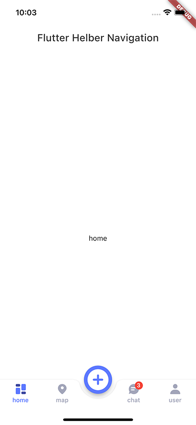

# Helber App 的底部导航



## 说明

这个组件是 https://helber.live/ 项目中的底部导航组件代码，在生产项目中通常都是自己画的组件。

现在抽出来给大家使用。

组件目录 `lib/widgets/navigation.dart`

`BuildNavigation` 实现了一个带凹陷的 `BottomAppBar`, 然后把 `floatingActionButton` 位置定在底部中间的位置

用到的三方组件是 `flutter_svg`, 因为 `svg icon` 能彩色显示, 比较生动

## 代码

具体代码见 `lib/main.dart`, 我已经加入了注释

```dart
  @override
  Widget build(BuildContext context) {
    return Scaffold(
      extendBody: true, // 扩展到Scaffold的底部
      resizeToAvoidBottomInset: false, // 不允许键盘事件影响界面
      appBar: AppBar(
        title: Text(widget.title),
      ),
      // PageController 控制 PageView 呈现页面
      body: PageView(
        physics: const NeverScrollableScrollPhysics(),
        controller: pageController,
        onPageChanged: onIndexChanged,
        children: const [
          DemoPage(title: "home"),
          DemoPage(title: "map"),
          DemoPage(title: "chat"),
          DemoPage(title: "user"),
        ],
      ),
      // 底部带凹下的导航
      bottomNavigationBar: BuildNavigation(
        currentIndex: currentIndex,
        items: [
          NavigationItemModel(
            label: "home",
            icon: SvgIcon.layout,
          ),
          NavigationItemModel(
            label: "map",
            icon: SvgIcon.marker,
          ),
          NavigationItemModel(
            label: "chat",
            icon: SvgIcon.chat,
            count: 3,
          ),
          NavigationItemModel(
            label: "user",
            icon: SvgIcon.user,
          ),
        ],
        onTap: onIndexChanged, // 切换tab事件
      ),
      floatingActionButton: FloatingActionButton(
        onPressed: () {},
        child: const Icon(Icons.add_circle_rounded, size: 50),
      ), // 浮动按钮
      floatingActionButtonLocation:
          FloatingActionButtonLocation.centerDocked, // 浮动按钮 停靠在底部中间位置
    );
  }
```
